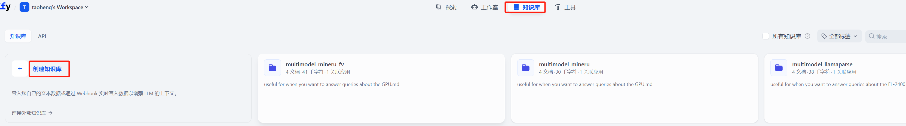
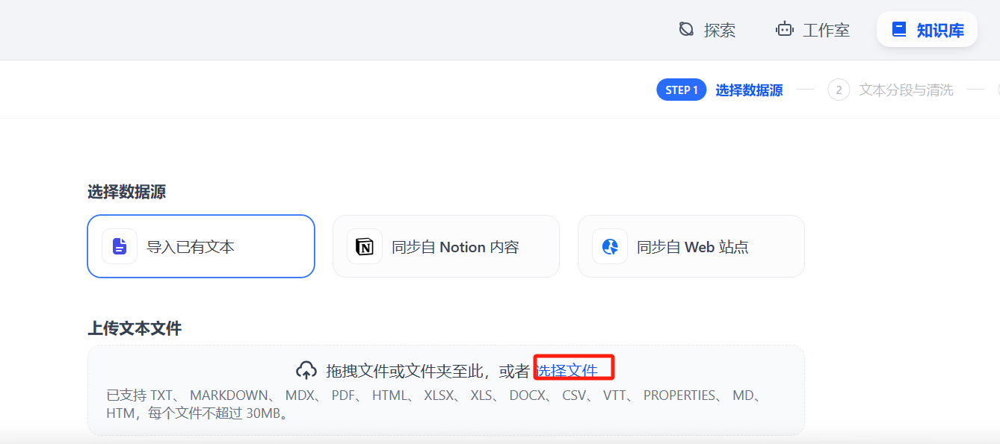
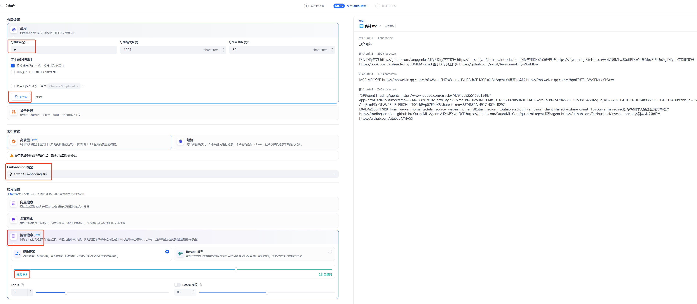
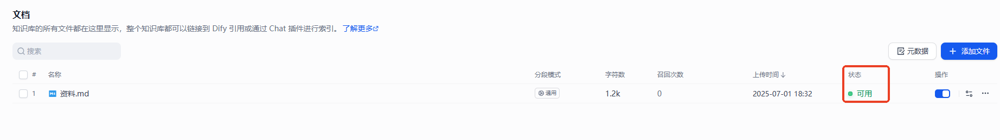
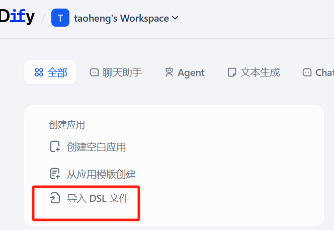
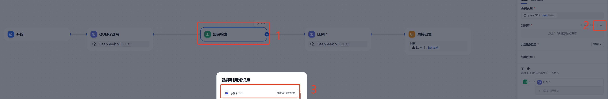
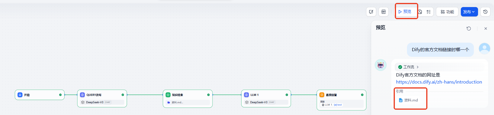
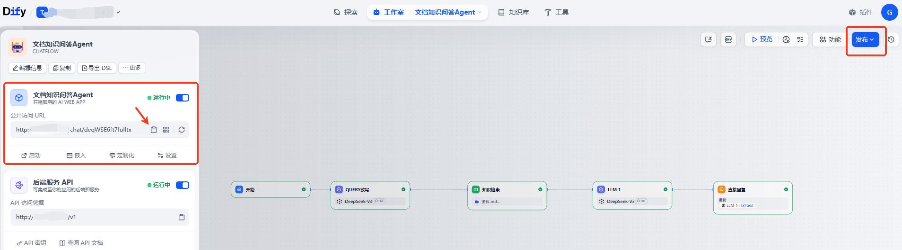
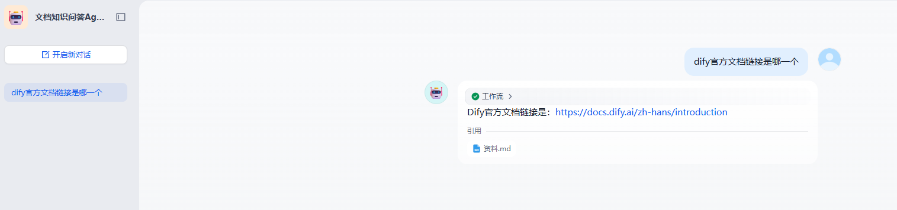

# 文档知识问答Agent使用说明

- [文档知识问答Agent使用说明](#文档知识问答agent使用说明)
  - [1. 搭建DIFY开发平台](#1-搭建dify开发平台)
  - [2. 构建知识库](#2-构建知识库)
    - [2.1 获取文档结构化工具的解析结果](#21-获取文档结构化工具的解析结果)
    - [2.2 打开Dify知识库页面，创建知识库](#22-打开dify知识库页面创建知识库)
    - [2.3 选择文件，多选所有需要导入的文件，然后点击下一步](#23-选择文件多选所有需要导入的文件然后点击下一步)
    - [2.4 设置知识库配置](#24-设置知识库配置)
    - [2.5 验证文档是否建立索引成功，看状态是否可用](#25-验证文档是否建立索引成功看状态是否可用)
  - [3. 搭建文档知识问答Agent](#3-搭建文档知识问答agent)
    - [3.1 导入流水线DSL文件](#31-导入流水线dsl文件)
    - [3.2 知识检索中配置对应知识库](#32-知识检索中配置对应知识库)
    - [3.3 验证RAG问答系统效果](#33-验证rag问答系统效果)
    - [3.4 发布文档知识问答Agent](#34-发布文档知识问答agent)


## 1. 搭建DIFY开发平台

下载Dify开源代码库，进行安装
```shell
git clone https://github.com/langgenius/dify

# 安装部署
cd dify/docker
cp .env.example .env
docker compose up -d
```

前往管理员初始化页面设置设置管理员账户
```shell
# 本地环境
http://localhost/install

# 服务器环境
http://your_server_ip/install
```

Dify 主页面：
```shell
# 本地环境
http://localhost

# 服务器环境
http://your_server_ip
```

更多使用方法，请参考Dify[官方文档](https://docs.dify.ai/zh-hans/introduction)

## 2. 构建知识库

### 2.1 获取文档结构化工具的解析结果
将`code/result`目录下文档结构化工具生成的markdown文档下载至本地

### 2.2 打开Dify知识库页面，创建知识库




### 2.3 选择文件，多选所有需要导入的文件，然后点击下一步




### 2.4 设置知识库配置

1. 分段标识符选择`#`分割符。因为markdown格式，`#`符号一般代表标题是较好语义分段的断点。
2. 点击“预览块” 可在右侧查看文档分块效果
3. 设置Embedding模型，该模型用于将文档映射为多纬向量
4. 检索设置选择“混合检索”
5. 最后点击“保存并处理”




### 2.5 验证文档是否建立索引成功，看状态是否可用



## 3. 搭建文档知识问答Agent

### 3.1 导入流水线DSL文件

[文档知识问答Agent.yml](文档知识问答Agent.yml) 



### 3.2 知识检索中配置对应知识库



### 3.3 验证RAG问答系统效果



### 3.4 发布文档知识问答Agent

1. 在Dify页面上完成Agent编辑后，即可点击页面右上角的“发布”按钮，将Agent对外公开使用。
2. 复制页面左侧公开访问URL至浏览器，即可进入对外公开页面进行提问。



回答效果如下

