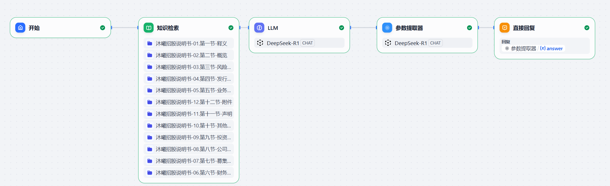
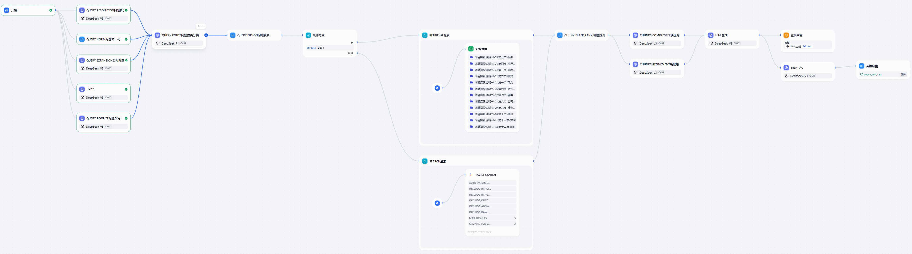
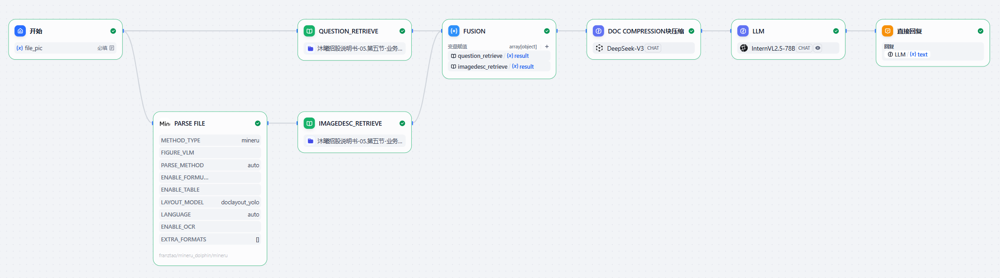
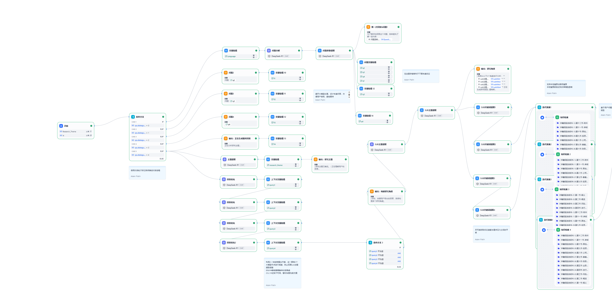

- [沐曦RAG方案介绍](#沐曦rag方案介绍)
- [方案支持功能列表](#方案支持功能列表)
- [沐曦RAG方案Dify组件图](#沐曦rag方案dify组件图)
  - [Naive RAG](#naiverag)
  - [Advanced RAG](#advancedrag)
  - [Simple Multimodel RAG](#simplemultimodelrag)
  - [Deep Research](#deep-research)

# 沐曦RAG方案介绍

| **方案名称** | **主要功能** | **优点** | **缺点** | **适用场景** |
| --- | --- | --- | --- | --- |
| **Naive RAG** | 基础检索增强生成：直接检索文档片段后输入生成模型（LLM）进行回答。 | \- 实现简单，适合快速部署<br>\- 计算资源要求低 | \- 检索与生成割裂，可能返回无关信息<br>\- 生成质量依赖原始检索效果 | 轻量级问答、快速原型验证 |
| **Advanced RAG** | 整合业界优化策略（如重排序、查询扩展、动态上下文压缩等），提升检索和生成效果。 | \- 显著改善回答准确性<br>\- 支持复杂场景（长文档、多跳问答） | \- 实现复杂度高，需调优多个模块<br>\- 计算成本较高 | 高精度问答、复杂逻辑推理（如金融、法律） |
| **Simple Multimodal RAG** | 支持多模态输入（如图片、文本），结合视觉语言模型（VLM）进行跨模态推理生成。 | \- 扩展RAG到多模态领域（如图像分析）<br>\- 适合多媒体内容理解 | \- 依赖高质量多模态数据和VLM训练<br>\- 计算开销大，需GPU支持 | 图文结合场景（如医疗影像、电商推荐） |
| **DeepResearch** | 通过论点规划构建“金字塔逻辑”，分阶段检索证据并生成结构化研究报告。 | \- 生成内容逻辑严谨，适合研究分析<br>\- 动态检索减少无关信息干扰 | \- 需预定义论点框架，灵活性低<br>\- 流程复杂，推理时间长 | 研究报告、学术分析等结构化输出需求 |


# 方案支持功能列表

| 模块 | 功能 |
| --- | --- |
| Doc parse 文档解析 | minerU pipeline多模态文档解析<br>dolphine end2end多模态文档解析<br>qwen2-VL 插图理解 |
| Query Expansion问题增强 | query分解<br>HyDE<br>多query扩展<br>query预处理<br>query路由<br>query重写 |
| Retrievaor search 检索或者搜索 | 全文检索<br>向量检索<br>混合检索<br>mcp工具tavily搜索 |
| Passage Reranker 上下文重排 | Jina 重排序器<br>Colbert 重排序器 |
| Passage 上下文操作 | chunk排序<br>chunk过滤<br>chunk压缩<br>chunk提炼<br>chunk 元数据过滤 |
| Prompt 提示工程 | 上下文支持记忆窗口 |
| Generator 生成 | 支持插图输入，VLM能力 |

# 沐曦RAG方案Dify组件图

## Naive RAG



## Advanced RAG



Advanced RAG方案中Dify各组件详细介绍如下：

--------------------------------  
```
1. 开始（start）  
• 作用：触发整个流程，把用户原始问题注入流水线。  
• 输入：无（外部触发）。  
• 输出：sys.query（字符串，用户问题）。
```
--------------------------------  
```
2. 问题改写链路（让检索关键词更丰富、规范）

2.1 query rewrite（LLM）  
  作用：用 LLM 把用户问题换一种更利于搜索的说法。  
  输入：sys.query  
  输出：text（单条改写后的问题）

2.2 query resolution（LLM）  
  作用：将问题拆成 3 条可独立回答的子问题/子查询。  
  输入：sys.query  
  输出：text（3 行子问题）

2.3 query expansion（LLM）  
  作用：从多个角度再生成 5 条相似问句，用于向量检索。  
  输入：sys.query  
  输出：text（5 行问句，\n 分隔）

2.4 query norm（Code）  
  作用：把“沐曦”等简称替换成全称，消除歧义。  
  输入：sys.query  
  输出：result（归一化后的字符串）

2.5 Hyde（LLM）  
  作用：用“先假设写一段科研论文”的方式生成伪答案，再把这段文字当作检索 query，提高召回（HyDE 技巧）。  
  输入：sys.query  
  输出：text（一段假设性论文内容）
```
--------------------------------  
```
3. 问题路由与融合

3.1 query route（LLM）  
  作用：判断用户问题是否与“沐曦产品”相关，输出 T / F。  
  输入：sys.query（由 2.1 改写后的问题）  
  输出：text（T 或 F）

3.2 query fusion（Code）  
  作用：把 2.1-2.4 产生的多条问题 + 上一轮 Self-RAG 缓存的问题合并成数组，供后续并行检索。  
  输入：arg1…arg5（依次为 2.2、2.1、2.3、2.4 结果以及 conversation.query_self_rag）  
  输出：result（字符串数组）
```
--------------------------------  
```
4. 条件分支（if-else）  
• 作用：根据 3.1 的 T/F 结果决定用“知识库检索”还是“联网搜索”。  
• 输入：1747536758172.text（T/F）  
• 输出：true → 连到迭代器 （知识库）  
         false → 连到迭代器 （联网搜索）
```
-------------------------------- 
```
5. 知识库检索链路（迭代器 retrieval）

5.1 retrieval（iteration 节点）  
  作用：对 3.2 输出的每条查询并行做知识库检索。  
  输入：迭代数组 = query fusion.result  
  输出：output（数组[object]，每条包含检索到的 chunk）

5.2 知识检索（knowledge-retrieval，位于 5.1 内部）  
  作用：真正的向量/关键词混合检索。  
  输入：单条查询（来自 5.1 的迭代变量）  
  输出：result（该查询命中的文档列表）
```
--------------------------------  
```
6. 联网搜索链路（迭代器 search）

6.1 search（iteration 节点）  
  作用：对 3.2 输出的每条查询并行做 Tavily 联网搜索。  
  输入：迭代数组 = query fusion.result  
  输出：output（数组[string]，每条是搜索结果的文本）

6.2 Tavily Search（tool，位于 6.1 内部）  
  作用：调用外部 Tavily API。  
  输入：query（单条查询）+ 其它默认参数（country=china, max_results=5…）  
  输出：text（该查询的搜索结果）
```
--------------------------------  
```
7. 统一后置处理（无论来自 5 还是 6 的 chunk 都会进入同一套后处理）

7.1 chunk filter,rank（Code）  
  作用：  
  ‑ 用 Reciprocal Rank Fusion 把多路结果合并去重；  
  ‑ 按融合得分排序；  
  ‑ 截取前 30 条。  
  输入：arg1（数组[object]，来自 5.1 或 6.1 的检索结果）  
  输出：result（数组[object]，已排序的精选 chunk）

7.2 chunks compresser（LLM）  
  作用：对上一步 chunk 做语义压缩，保留关键信息，减少 token。  
  输入：context（7.1.result）  
  输出：text（压缩后的文本）

7.3 chunks refinement（LLM）  
  作用：基于压缩后的上下文提炼 1-3 个新观点，用于增强最终回答的深度。  
  输入：context（7.1.result）  
  输出：text（观点提炼内容）

7.4 LLM 生成（最终回答 LLM）  
  作用：把 7.1/7.2/7.3 的全部信息作为上下文，生成面向用户的答案。  
  输入：  
    ‑ context（7.1.result：原始 chunk）  
    ‑ 7.3.text（观点提炼）  
    ‑ 7.2.text（压缩文本）  
    ‑ sys.query  
  输出：text（最终答案）
```
--------------------------------  
```
8. 直接回复（answer）  
  作用：把 7.4 生成的答案直接返回给用户。  
  输入：text  
  输出：前端可见的最终回复。
```
--------------------------------  
```
9. Self-RAG 闭环（可选迭代）

9.1 Self RAG（LLM）  
  作用：根据“原问题 + 已生成答案”再反思，产生一个更优质的查询。  
  输入：  
    ‑ 初始问题 = sys.query  
    ‑ 原先生成的回答 = 7.4.text  
  输出：text（新的、更精准的查询）

9.2 变量赋值（assigner）  
  作用：把 9.1 产出的新查询写进 conversation.query_self_rag，供下一轮检索使用（形成循环）。  
  输入：text  
  输出：conversation.query_self_rag（字符串，写入会话变量）
```
--------------------------------  
```
10. 会话级变量  
• query_self_rag：字符串，用于存放 Self-RAG 迭代中的最新查询。  
```
--------------------------------  


## Simple Multimodel RAG



## Deep Research

**工作流概述**  
本系统基于Dify平台开发，模仿Deep Research的核心功能，结合多来源信息检索（本地资料库+互联网搜索）和多个AI模型协作，能在5分钟内产出万字以上的结构化研究报告。系统采用模块化设计，可轻松更换AI模型和数据来源。

**主要功能**

1.  **智能分析主题**
    
    *   支持从4个角度深入分解主题
    
2.  **混合搜索功能**
    
    *   同时查询本地资料库和搜索引擎等网络资源
    
3.  **智能流程控制**
    
    *   采用双模型协作架构
        
    *   自动优化处理步骤和节奏
    
4.  **快速生成报告**
    
    *   生成分段内容并自动整理为Markdown格式文档
        

